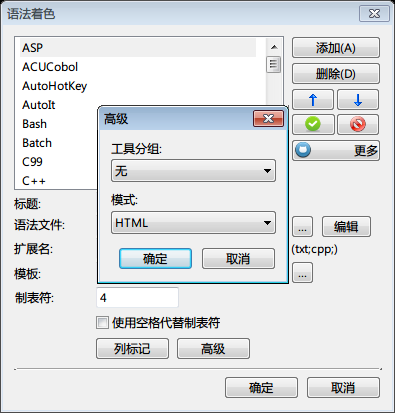
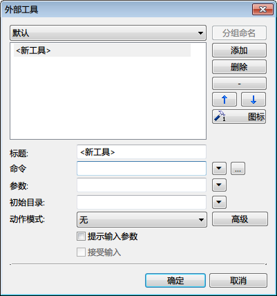

EverEdit对外部工具提供了极其丰富的支持，不仅可以捕获外部工具的stdout，stderr输出，还为外部工具的输出动作提供了非常多的选项。除此之外，EverEdit还为编译器的调错提供了简单、易用的设置。

#分组
EverEdit提供了1个默认分组+9个用户分组，以方便用户按照各种工具的使用场景进行组合。默认分组中的工具将会始终显示在菜单中，按钮将会被自定义工具覆盖。

####自定义分组的意义

在日常生活中，我们往往会使用多种编程语言进行组合，比如c++,java,c#,lua,python等。每一种语言都会有一系列的工具进行编译，运行，调试等。这样我们可以为每一种语言定义一个分组，绑定多个工具。

####绑定分组到语法文件
我们可以把某个分组的一系列工具绑定到某个语法文件中，这样切换到该类型的语法文件时，自定义工具的菜单和主工具条的按钮都会自动的切换到合适的工具中，非常的方便。如需为语法文件绑定工具的话，打开语法着色对话框，点击高级，按照下图设置。

#设置对话框

####为工具绑定图标

点击对话框中的图标按钮，选择合适的图标即可。EverEdit将会自动刷新主工具条上的对应按钮。

**注意**：您需要实现把图标置于主工具条。打开选项对话框，选择工具条，把工具条1-9放置到主工具条即可。1-9分别代表着当前工具分组中的第1-9个工具。

#具体设置
####命令
命令可以是一个带有全路径的exe\batch，或者当前环境上下文有效的exe\batch等程序。如果您为命令指定了一个目录路径。那么EverEdit执行该工具时，EE将会自动打开该目录。

**注意**：如果程序的路径含有空格，请用引号"括起来，不然会显示找不到路径的错误。

####参数
在这儿选择传递到命令中定义的可执行程序的参数。根据可执行程序的需要，选择是否用引号扩住参数。

####初始目录
初始目录对部分可执行程序有着重要的意义。一般的来说，初始目录往往是exe所在的路径。如果您不知道该选择什么，请始终选择$(FileDir)

